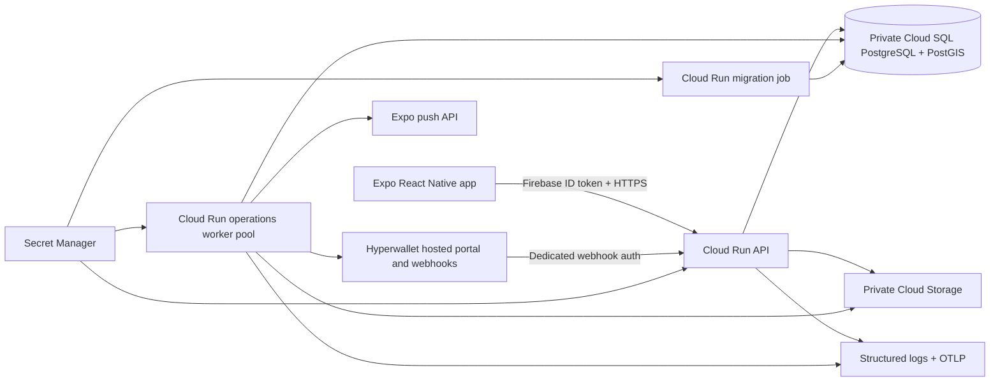

# GoGymGo backend architecture

## Decision

GoGymGo uses a server-authoritative modular monolith. The mobile app is an untrusted presentation client; the backend owns account legal document versions and receipts, competition eligibility, draws, payout state, ledger entries, provider reconciliation, privacy operations, and operator authorization.

This is intentionally not a microservice fleet. A single TypeScript codebase and PostgreSQL transaction boundary keep draw, payout, ledger, idempotency, and audit invariants inspectable. Modules remain separated in code so a workload can be extracted only when measured throughput or organizational ownership justifies the added network and operational failure modes.

## Runtime split

| Workload          | Platform              | Responsibility                                                                                           | Public network                          |
| ----------------- | --------------------- | -------------------------------------------------------------------------------------------------------- | --------------------------------------- |
| API               | Cloud Run service     | Authenticated HTTP, Hyperwallet webhook intake, user/operator reads and commands                         | Yes; application auth remains mandatory |
| Operations worker | Cloud Run worker pool | Continuous database polling, competition lifecycle, provider reconciliation, notifications, privacy work | No endpoint                             |
| Migration         | Cloud Run job         | Forward-only schema migrations before a release                                                          | No endpoint                             |

All workloads use one digest-pinned image. The release pipeline updates and executes migration first, then updates the worker, then deploys the API as a tagged zero-traffic candidate. User traffic moves only after candidate and worker readiness succeeds. Terraform owns topology and ignores later image-only drift so an infrastructure apply cannot bypass this order.

## Data and concurrency

PostgreSQL is the sole system of record. PostGIS handles regional competition boundaries. Constraints, append-only events, immutable identifiers, optimistic versions, advisory locks, leases, and idempotency keys enforce correctness at the database boundary instead of relying on client behavior or in-memory locks.

Competition enrollment takes a row lock on the authoritative competition before checking registration state, entrant capacity, and inserting the enrollment. This serializes concurrent entrants at the cap without a distributed lock. An existing enrollment is immutable through the create route: an exact active retry returns the original record, changed enrollment details fail closed, and an inactive or disqualified enrollment cannot be recreated by the user.

Legal documents are immutable content-hashed records with append-only publication and withdrawal events. The current bundle resolves each document key from exact subdivision to country to global scope but never crosses locales. A user submits all required document receipts atomically; competition enrollment stores and validates the exact server-timestamped receipt bundle for that competition jurisdiction. Missing, foreign, incomplete, jurisdiction-mismatched, or superseded bundles fail closed.

Workout submissions remain untrusted until review. An operator first reads a privacy-minimized server summary whose SHA-256 commits to the exact immutable session, rules, and event set. Approval must return that digest plus typed findings for every evidence category; the transaction recomputes the digest, rejects stale reviews, requires every rule-required category to be approved, derives its own verification summary, and binds the ledger/audit records to the snapshot. This is an accountable manual fallback, not provider attestation. Cash launch still requires approved server-side device, signed-QR, wearable, and liveness integrations for every evidence type required by policy.

The first production stage uses database-backed work queues. This keeps a payout or privacy state transition and its queued work in one transaction. Add Pub/Sub or Cloud Tasks only when queue latency, connection pressure, or independently scaling consumers demonstrate a need; introducing either earlier would add duplicate-delivery and cross-system consistency work without reducing current financial risk.

Each environment has one regional primary database with regional high availability, private networking, automated backups, and point-in-time recovery. North America-wide client access does not require an active-active financial ledger. A single writer avoids conflicting payout and draw decisions; add a read strategy or disaster-recovery replica only after recovery targets and jurisdictional requirements are approved.

## Payout risk boundary

Hyperwallet hosts payee onboarding and bank-account collection. GoGymGo stores provider references and safe statuses, not bank credentials. Provider secrets remain server-side in Secret Manager. Every release/payment operation uses an immutable client payment ID, records an append-only audit trail, treats ambiguous submissions as uncertain, and reconciles provider state before an operator can retry.

This lowers operational and data-security exposure, but it does not transfer every legal obligation. Hyperwallet program approval, prize-law review, tax reporting allocation, sanctions/eligibility rules, age rules, Quebec requirements, and competition terms still require qualified business/legal sign-off before production launch.

## Identity, secrets, and privacy

- Firebase is enabled in the same isolated Google Cloud project as each environment. The API verifies Firebase ID tokens; operator/admin rights come from audited database roles rather than client claims.
- API, worker, and migration use distinct service accounts and explicit runtime roles. The API cannot read the privacy-pseudonymization or Expo worker secrets; the worker cannot read Hyperwallet webhook credentials. IAM grants are per bucket, per secret, and per workload.
- Terraform creates secret containers only. Secret versions are populated out of band so credentials do not enter Git history, Terraform state, Expo variables, image layers, or CI logs.
- User content and privacy exports use separate private buckets with public-access prevention and uniform bucket-level access. Privacy exports expire after seven days and do not use soft delete or object versioning.
- Avatar uploads use five-minute V4 create-only actions bound to exact content type and length. New media remains owner-private and pending moderation; only an audited operator approval can activate it. The API can create/read only the `avatars/` prefix, while worker-only deletion handles rejection, replacement, removal, expiry, and erasure.
- Account erasure is an approved, leased worker operation that removes direct identity/content while preserving legally necessary pseudonymized payout, competition, fraud, ledger, and audit evidence.
- Privacy exports include account legal receipt metadata. Erasure preserves pseudonymous document-version, digest, jurisdiction, locale, action, and acceptance-time evidence without storing IP addresses or device fingerprints in the receipt path.

## Health and observability

- `/v1/health` is dependency-free API liveness and is the Cloud Run startup/liveness probe.
- `/v1/health/ready` checks PostgreSQL and the durable worker heartbeat; an external uptime check alerts without forcing an otherwise healthy API process to restart.
- `/v1/operator/system-health` adds queue depth, uncertain payments, pending webhooks, profile-media cleanup, privacy work, and safe worker failure codes for authorized operators.
- Structured logs redact authentication, financial, location, and evidence fields. Error logs contain safe error types, status, request IDs, and trace correlation—not exception messages.
- Optional OpenTelemetry exports HTTP, Express, PostgreSQL, and worker traces/metrics to an HTTPS collector. Log-based metrics alert on API server errors and worker batch failures; Cloud Monitoring also watches readiness and Cloud SQL CPU.

## Production gates outside the repository

The architecture is code-complete only after these external gates are satisfied in staging:

1. isolated Google Cloud/Firebase projects, remote Terraform state, Workload Identity Federation, DNS, and notification channels;
2. a least-privilege PostgreSQL login and Secret Manager versions;
3. Hyperwallet account/program approval, hosted-portal URLs, webhook registration, and end-to-end UAT payouts/refunds/reconciliation;
4. Expo credentials and real-device notification testing;
5. server-side Apple App Attest/Google Play Integrity validation, partner-signed QR verification, and approved wearable/liveness integrations for every required competition evidence type, with replay/outage/appeal UAT on real devices;
6. counsel-approved legal document publication for every enabled jurisdiction/locale, mobile stale-document UAT, emergency withdrawal rehearsal, privacy export/erasure rehearsal, restore rehearsal, operator bootstrap, incident runbooks, and legal/compliance approval;
7. load tests that confirm API instance limits, worker count, and database connection budgets before raising them.

The infrastructure implementation is in [Terraform](../infra/terraform/README.md), and release/incident procedures are in the [deployment runbook](deployment-runbook.md).
