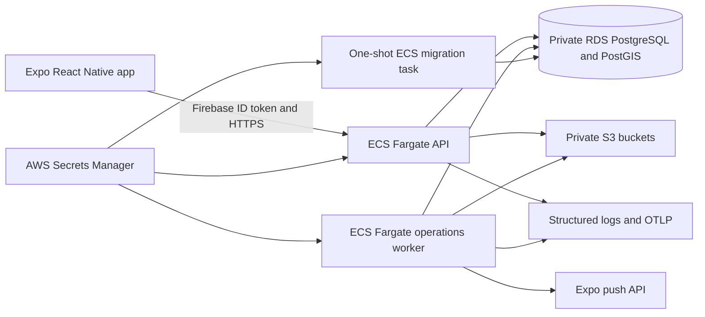

# GoGymGo backend architecture

## Decision

GoGymGo uses a server-authoritative NestJS modular monolith. The Expo app is an
untrusted presentation client; PostgreSQL owns legal receipts, regional contest
eligibility, entry ledgers, draws, reward inventory, awards, claims, social
relationships, privacy operations, and operator authorization.

A single codebase and database transaction boundary keep contest, reward,
ledger, idempotency, and audit invariants inspectable. Modules remain separated
so a workload can be extracted only when measured throughput or ownership
justifies the additional failure modes.

## Runtime split

| Workload          | Platform                          | Responsibility                                                   | Public network                               |
| ----------------- | --------------------------------- | ---------------------------------------------------------------- | -------------------------------------------- |
| API               | ECS Fargate service behind an ALB | Authenticated HTTP, public catalog reads, user/operator commands | ALB only; application auth remains mandatory |
| Operations worker | ECS Fargate service               | Contest lifecycle, notifications, media cleanup, privacy work    | No inbound rule or endpoint                  |
| Migration         | One-shot ECS Fargate task         | Forward-only schema migrations before a release                  | No inbound rule or endpoint                  |

All workloads use one digest-pinned image. Release order is migration, worker,
then an ECS rolling API deployment protected by load-balancer health checks and
circuit-breaker rollback. Readiness must succeed before the release completes.

## Data and concurrency

PostgreSQL is the sole system of record. Constraints, append-only events,
immutable identifiers, optimistic versions, row/advisory locks, leases, and
idempotency keys enforce correctness at the database boundary.

Enrollment locks its competition before checking registration state and entrant
capacity. Workout evidence remains untrusted until a deterministic,
privacy-minimized review is approved. Draw lock reconciles final scoring and
persists immutable, hashed entrant, scoring, public-identity, reward-catalog,
and exact reward-slot snapshots after the 15-minute workout completion
boundary. Settlement verifies the canonical commitment reveal, re-hashes every
snapshot, selects unique winners with a deterministic unbiased weighted
algorithm, and creates exact-slot reward awards in one transaction. Deferred
database constraints reconcile snapshot counts, competition/draw lifecycle
state, and exactly one lock/settle audit event. Unique constraints, row locks,
and the locked-slot integrity trigger prevent duplicate or excess awards. Claims and
admin fulfillment transitions are owner/role scoped, row-locked, idempotent,
optimistically versioned, and preserve exact lifecycle timestamps.

Coupon codes are NFKC-normalized and encrypted with AES-256-GCM using an
API-only, canonical 32-byte standard-base64 secret. Database rows contain
ciphertext and a one-way duplicate fingerprint. Plaintext is never
logged, exported, returned in catalog data, or available to workers; it is
revealed only to the authenticated award owner during an idempotent claim, and
claim idempotency records store a redacted response marker. Published rewards
require approved HTTPS image and terms URLs. Physical rewards use exactly one
sponsor instruction path or HTTPS claim URL; coupon rewards use neither and do
not require GoGymGo to collect a shipping address.

There is no cash-value field, payment provider, payee onboarding, bank-account
collection, payment webhook, or transfer reconciliation in the current model.
See [brand rewards marketplace](../product/brand-rewards-marketplace.md).

## Identity, secrets, and privacy

- Firebase verifies account identity. Operator/admin rights come from audited
  database roles, not client claims.
- API, worker, and migration use separate IAM roles. The coupon-code key
  is mounted only into the API; privacy and notification secrets remain
  worker-only.
- Terraform creates secret containers only. Secret versions are populated out
  of band and never enter Git, Terraform state, Expo variables, images, or logs.
- User content and privacy exports use separate private buckets. Direct account
  identity/content is erased through an approved leased operation while
  pseudonymous contest, reward, fraud, ledger, legal, and audit integrity is
  retained where required.

## Health and observability

- `/v1/health` is dependency-free liveness.
- `/v1/health/ready` checks PostgreSQL and the durable worker heartbeat.
- `/v1/operator/system-health` reports queue, media, privacy, notification, and
  safe worker failure state to authorized operators.
- Structured logs redact authorization, coupon-code arrays, locations, and
  evidence. Optional OTLP exports to an HTTPS collector.

## External production gates

Code completion does not replace these staging approvals:

1. isolated AWS member accounts and Firebase projects, remote Terraform state, GitHub OIDC,
   DNS, backups, restore rehearsal, and notification channels;
2. least-privilege database credentials and secret versions, including a random
   32-byte coupon encryption key;
3. sponsor contracts covering inventory, images, terms, expiry, fulfillment,
   substitutions, support ownership, and secure coupon delivery;
4. real-device notification, camera, static-QR and live-location tests for the
   September pilot policy;
5. counsel-approved contest and privacy documents for each enabled region and
   locale, plus operator, export, erasure, and incident rehearsals;
6. load tests confirming API, worker, and database connection budgets.

Provisioning is in [Terraform](../../infrastructure/aws/terraform/README.md);
ordered release and incident procedures are in the
[deployment runbook](../operations/api-deployment.md).
