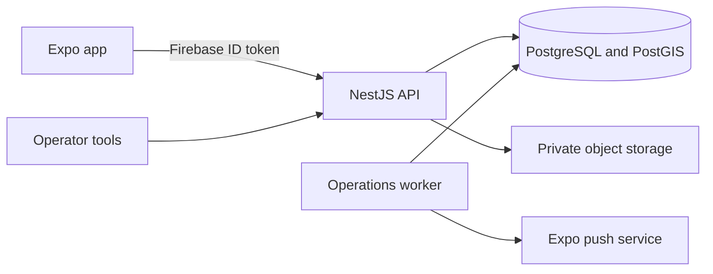

# GoGymGo backend handoff architecture

Status: current frontend decision record, July 2026

## Decision

Use a NestJS modular monolith, Firebase Authentication, PostgreSQL/PostGIS, a
database-backed operations worker, and private object storage. The Expo app is an
untrusted client. Regional contests award sponsor-funded physical products and
coupon codes through a server-authoritative rewards marketplace.

## Trust boundaries

- The API derives the account from a verified Firebase token and never trusts a
  client-supplied user ID.
- Only the server creates verified sessions, entries, draw snapshots, winners,
  reward awards, or coupon assignments.
- Retried value-bearing writes require idempotency keys and operator mutations
  require append-only audit events.
- Coupon plaintext is encrypted at the API boundary, redacted from logs, and
  revealed only to the authenticated award owner after claim.
- Physical fulfillment uses a sponsor HTTPS claim URL or instructions. The app
  does not collect a shipping address.
- AsyncStorage is only a convenience cache and never the source of truth for
  consent, eligibility, verification, inventory, or claims.
- The product has no cash, bank-account, payee, or payment-provider workflow.

## Stack

| Layer      | Choice                                      | Purpose                                             |
| ---------- | ------------------------------------------- | --------------------------------------------------- |
| Mobile     | Expo, React Native, Expo Router, TypeScript | Shared iOS, Android, and preview UI                 |
| Identity   | Firebase Authentication                     | Email, Apple, and Google identity                   |
| API        | NestJS on ECS Fargate                       | Modules, guards, validation, OpenAPI                |
| Data       | PostgreSQL/PostGIS through Kysely           | Transactions, constraints, regional policy          |
| Migrations | node-pg-migrate                             | Reviewable forward schema history                   |
| Jobs       | PostgreSQL leases                           | Retryable lifecycle, push, media, and privacy work  |
| Media      | Private Amazon S3                           | Signed avatar/media operations                      |
| Rewards    | PostgreSQL plus AES-256-GCM                 | Regional catalog, inventory, awards, coupon secrecy |

## Module ownership

| Module                 | Owns                                                                                 |
| ---------------------- | ------------------------------------------------------------------------------------ |
| Auth and profiles      | Firebase guard, account status, public identity                                      |
| Regions                | Versioned service areas and eligibility evidence                                     |
| Competitions           | Definitions, brackets, enrollment, rules versions, Weekly Challenge partner requests |
| Sessions and ledger    | Evidence, review snapshots, append-only entries                                      |
| Leaderboards and draws | Read models, locked entrant snapshot, selection                                      |
| Rewards                | Catalog, inventory, awards, claims, encrypted coupon codes                           |
| Social                 | Screen-name search, friend requests, challenges, hashed contact invitations          |
| Creator workouts       | Public catalog, rights-attested submissions, calendar plans                          |
| Notifications          | Preferences, templates, delivery attempts                                            |
| Operator/privacy       | Configuration, audit, export, erasure, support queues                                |

## Frontend connection readiness

The mobile app has two explicit data modes: `api` for server data and
`unavailable` for honest empty/error states when the API is not configured.
There is no local data source that can imitate production records.

| Product flow                                | Mobile adapter                                                          | Server contract                                         | Current status                                                                                                                                 |
| ------------------------------------------- | ----------------------------------------------------------------------- | ------------------------------------------------------- | ---------------------------------------------------------------------------------------------------------------------------------------------- |
| Firebase account access                     | `state/auth.tsx`                                                        | Firebase ID token guard                                 | Connected                                                                                                                                      |
| Alias and friend discovery                  | `data/socialRepository.ts`                                              | `GET/PATCH /v1/me`, social routes                       | Connected; UI term is **alias**, API field remains `screenName`                                                                                |
| Friends and social challenges               | `data/socialRepository.ts`                                              | `/v1/social/*`                                          | Connected                                                                                                                                      |
| Leaderboards, results, streaks, and rewards | `data/appData.ts`                                                       | leaderboards, `GET /v1/results/mine/latest`, streaks, rewards | Connected; an ended participant sees the pending audit once, then the exact settled contest, category champions, and reward winners once published |
| Creator catalog, planning, and submission   | `data/appData.ts`                                                       | `/v1/creator-workouts/*`                                | Connected                                                                                                                                      |
| Profile image                               | `data/accountSettingsRepository.ts`, `state/profile.tsx`                | `/v1/me/avatar*`                                        | Connected through exact-size signed upload, moderation state, private read URL, and removal                                                    |
| Legal documents and receipts                | `data/accountReadinessRepository.ts`                                    | `/v1/legal-documents/current`, `/v1/me/legal-receipts*` | Connected; exact current bundle is displayed and receipted during registration                                                                 |
| Region eligibility                          | `data/accountReadinessRepository.ts` plus `state/competitionRegion.tsx` | `/v1/regions`, `/v1/me/region-verifications*`           | Connected; pending reviews cannot be presented as approved                                                                                     |
| Competition enrollment                      | `hooks/useCompetitionRegistration.ts`, Profile                          | `/v1/competitions/current*`, enrollment and withdrawal commands | Connected; confirmation requires legal receipt and approved region evidence. Withdrawal atomically closes active workouts and open Weekly Challenge participation while retaining the historical record |
| September verified gym session              | `data/gymScanRepository.ts`, `app/(modals)/qr-scanner.tsx`              | `POST /v1/gym-scans`                                    | Connected; authenticated start and finish location-check commands reuse the gym selected at enrollment, then start, report early, verify or reject the session using server time and live location |
| Competition reminders                       | notification and push-registration services                             | `/v1/me/push-devices*`                                  | Connected; local schedules and the authenticated Expo push device are enabled/disabled together                                                |
| Privacy export/deletion                     | `data/accountSettingsRepository.ts`, `/account-data`                    | `/v1/me/privacy-requests*`                              | Connected with request history, guarded deletion, and short-lived export download actions                                                      |

### Integration order

1. Run the generated OpenAPI audit and real-device loading, empty, error, retry,
   permission-denied, and expired-session scenarios before enabling API mode.
2. Configure S3 upload CORS for the signed avatar headers and set the EAS
   project ID used to mint Expo push tokens in release builds.
3. Confirm the session-review worker refresh cadence against the mobile
   `/v1/me/progress` query and notification expectations.

`services/api/scripts/audit-frontend-contract.mjs` is the release gate for every
mobile-facing operation, including adapters that are staged but not yet wired.
Adding or removing a product flow requires updating both this matrix and that
contract gate.

## Core reward contract

- `GET /v1/rewards/catalog?region=&monthKey=`
- `GET /v1/rewards/awards/me`
- `POST /v1/rewards/awards/{awardId}/claim`
- `GET /v1/results/mine/latest`
- `POST /v1/operator/configuration/rewards`
- `PUT /v1/operator/configuration/rewards/{rewardId}`
- `POST /v1/operator/configuration/rewards/{rewardId}/coupon-codes`
- `POST /v1/operator/configuration/rewards/{rewardId}/status-action`

The catalog is public and contains presentation-safe inventory only. Award and
claim routes are authenticated. Operator mutations require a database role,
reason, idempotency key, and optimistic version where applicable.

## Invariants

- One enrollment per user and competition; one ledger award per source event.
- Draw settlement locks an immutable eligible snapshot and rules version.
- Published reward inventory is positive and region-scoped by competition.
- One winner and one rank per draw; awards cannot exceed catalog inventory.
- Coupon fingerprints are globally unique and coupon plaintext is absent from
  logs, public catalog data, privacy exports, and other users' responses.
- Every administrative decision stores actor, reason, state, and timestamp.

## Handoff sequence

1. Provision isolated staging and production AWS member accounts, Firebase
   projects, private RDS/PostGIS, GitHub OIDC, Secrets Manager, S3, backups, and
   monitoring.
2. Populate `DATABASE_URL` and a random 32-byte base64
   `REWARD_CODE_ENCRYPTION_KEY` outside Terraform state.
3. Run the committed OpenAPI and mobile contract checks.
4. Execute the forward-only brand-rewards migration before worker/API rollout.
5. Configure sponsor inventory in draft, load coupon codes where applicable,
   publish rewards, then publish the regional competition.
6. Validate loading, empty, error, physical-claim, coupon-claim, duplicate retry,
   and out-of-stock behavior on real devices.
7. Complete regional contest, privacy, sponsor-terms, fulfillment, fraud, and
   incident approval before enabling registration.

Detailed endpoints and migration instructions are in
`docs/product/brand-rewards-marketplace.md`.
