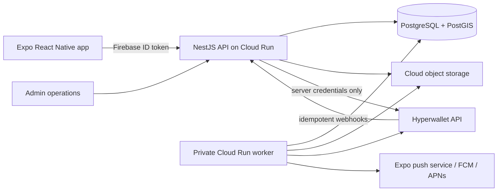

# GoGymGo Backend Handoff Architecture

Status: frontend decision record, July 2026

## Decision

Build the first production backend as a TypeScript modular monolith. Keep the Expo app as an untrusted client, Firebase Authentication as the identity provider, PostgreSQL/PostGIS as the system of record and durable work queue, a separately deployed worker for asynchronous operations, and Hyperwallet Pay Portal as the hosted payout experience. Add Redis only after measured load shows that PostgreSQL-backed reads or jobs are the bottleneck.

This is the lowest-risk initial shape because it has one API boundary, one authoritative relational datastore, explicit financial ledgers, and no bank, tax, or identity-document collection in the mobile app. Do not split into microservices until real load or team ownership requires it.

## Non-negotiable trust boundaries

- The app may display progress, but only the API can create verified sessions, competition entries, winners, or payouts.
- Firebase UID is the account identity. The API verifies every Firebase ID token and derives the user from the token; it never trusts a user ID supplied by the client.
- Every write that can award money uses an idempotency key and an append-only audit event.
- Workout evidence is uploaded as events. Server policy decides whether it is valid and records the policy version used.
- Hyperwallet API credentials, user tokens, payment tokens, webhook processing, and payout decisions remain server-side.
- GoGymGo never receives or stores a winner's bank-account number, tax form, or identity document. The winner enters that data in Hyperwallet's hosted Pay Portal.
- AsyncStorage is only a convenience cache. It is unencrypted and cannot be a source of truth for money, consent, eligibility, or verification.

## Recommended production stack

| Layer | Choice | Why |
| --- | --- | --- |
| Mobile | Expo SDK 57, React Native, Expo Router, TypeScript | Already implemented and validated across native/web bundles. |
| Identity | Firebase Authentication | Already integrated; supports email, Google, and Apple without a second auth migration. |
| API | NestJS modular monolith on Cloud Run | TypeScript end to end, clear modules, OpenAPI support, managed scaling. |
| Data | Cloud SQL PostgreSQL + PostGIS | Transactions, constraints, auditability, geographic eligibility, and financial ledgers. |
| SQL access | Kysely + `pg`; `node-pg-migrate` for migrations | Typed queries with explicit SQL and reviewable migrations, including PostGIS and ledger constraints. |
| Jobs/cache | PostgreSQL leases + private worker | Durable webhook, payout, notification, and privacy retries without another stateful dependency. Add Redis only for measured non-authoritative cache/queue pressure. |
| Media | Cloud Storage signed uploads | The app uploads directly with a short-lived signed URL; the database stores metadata and moderation state. |
| Payouts | Hyperwallet Pay Portal + REST API + webhooks | Provider-hosted payee setup and transfer methods keep sensitive financial onboarding out of GoGymGo. |
| Contracts | OpenAPI generated by NestJS | One versioned contract for the mobile client, backend implementation, tests, and admin tooling. |
| Observability | OpenTelemetry, Pino, managed error reporting/Sentry SDK | Correlated request, job, webhook, and payout audit trails. Never log tokens or sensitive payout data. |

The existing Supabase CLI scaffold is removed by this decision. A direct Supabase mobile client would create a second identity/data policy surface and is not appropriate for authoritative prize or payout writes. Supabase-hosted PostgreSQL could still be reconsidered as infrastructure, but only behind the same API boundary.

## Open-source packages to adopt deliberately

### Frontend next

| Package | Purpose | Timing |
| --- | --- | --- |
| `@tanstack/react-query` | Async server state, retries, invalidation, loading/error states, React Native lifecycle support | Implemented as the repository/query boundary; connect and refine policies with the first OpenAPI endpoints. |
| `zod` | Runtime validation of API and deep-link payloads | Add with generated API contracts. |
| `react-hook-form` + `@hookform/resolvers` | Consistent forms and server error mapping | Add while connecting onboarding/application forms. |
| `@react-native-community/netinfo` | Online/offline query behavior | Add with React Query. |
| `expo-secure-store` | Small secrets or device-bound opaque tokens only; not general app data | Add only if the backend issues a value Firebase cannot manage. |
| `expo-camera` | Real signed partner-gym QR scanning | Add when the backend defines signed QR payloads and replay rules. |
| `expo-local-authentication` | Device-owner confirmation before sensitive local actions | Add for step-up UX; never treat it as proof that a workout occurred. |
| Maestro | Device-level onboarding, account-switching, workout, and payout E2E tests | Add before beta. |
| MSW | Contract-level API mocks for component and failure-state tests | Add with the query layer. |

Expo documents AsyncStorage as unencrypted storage, SecureStore as encrypted small-value storage, LocalAuthentication as a device biometric prompt, Camera as a camera/barcode interface, and Notifications as the native push interface. Use those narrow capabilities rather than custom native code where possible:

- <https://docs.expo.dev/versions/latest/sdk/async-storage/>
- <https://docs.expo.dev/versions/latest/sdk/securestore/>
- <https://docs.expo.dev/versions/latest/sdk/local-authentication/>
- <https://docs.expo.dev/versions/latest/sdk/camera/>
- <https://docs.expo.dev/versions/latest/sdk/notifications/>
- <https://tanstack.com/query/v5/docs/framework/react/react-native>

### Backend next

| Package | Purpose |
| --- | --- |
| `@nestjs/*` | API modules, guards, validation, OpenAPI, and testing. |
| `firebase-admin` | Firebase ID-token verification and account administration. |
| `kysely`, `pg`, `node-pg-migrate` | Typed SQL, transactions, and explicit migrations. |
| `@google-cloud/storage` | Private JSON exports, object deletion, and short-lived V4 download actions. |
| `pino` | Structured logs with mandatory redaction. |
| `@opentelemetry/*` | Trace API, SQL, queues, and external-provider calls. |
| `testcontainers` | Integration tests against real PostgreSQL/PostGIS containers. |

NestJS documents rate limiting at <https://docs.nestjs.com/security/rate-limiting>.

## Hyperwallet: lowest-risk implementation

Use the Pay Portal payout experience, not a custom bank-account form.

1. A server-side draw process settles a winner and creates a pending `PayoutClaim` in one transaction.
2. Operations/fraud review approves the claim. No payout is created from a client action.
3. The backend idempotently creates or retrieves the Hyperwallet user using the internal user ID as `clientUserId`.
4. The app receives only claim status and a provider-approved hosted activation/portal action. The exact portal-session mechanism must be finalized with the assigned Hyperwallet implementation specialist.
5. Hyperwallet collects identity, tax, and transfer-method data. Bank details never pass through GoGymGo.
6. Hyperwallet webhooks update the claim/payment state. Store each webhook token before processing so duplicate delivery is harmless, then reconcile against the Hyperwallet API.
7. The worker sends a push notification for `action_required`, `processing`, `paid`, or `failed`; operations handles exceptions in an admin queue.

Hyperwallet's official documentation confirms that Pay Portal can collect payee details during activation, transfer methods are configured by program and geography, API calls require server credentials, and webhook tokens should be stored for deduplication:

- <https://docs.hyperwallet.com/content/api/v4/resources/users/create>
- <https://docs.hyperwallet.com/content/pay-portal-payout-experience/v1/create-transfer-method>
- <https://docs.hyperwallet.com/content/api/v3/overview/accessing-the-api>
- <https://docs.hyperwallet.com/content/webhooks/v1/integration>

Do not add Plaid, Stripe Financial Connections, or another bank-linking SDK for payouts. Hyperwallet is the bank/transfer-method boundary; a second connector adds cost, consent, support, and data-liability surfaces without improving this payout flow.

## Backend modules and ownership

| Module | Owns |
| --- | --- |
| Auth | Firebase token guard, user bootstrap, roles, account status. |
| Profiles | Public identity, avatar metadata, privacy settings. |
| Regions | Versioned service areas, residency evidence, country/currency/time-zone policy. |
| Competitions | Competition definitions, goal brackets, enrollment, rules version. |
| Sessions | Check-in/out evidence, signed QR events, device evidence, review status. |
| Ledger | Append-only entry awards/reversals with reason and source event. |
| Leaderboards | Indexed PostgreSQL truth; optional non-authoritative cache only after profiling. |
| Draws | Locked entrant snapshot, audited randomness input/output, winner settlement. |
| Payouts | Claims, Hyperwallet mapping, payments, webhooks, reconciliation. |
| Partnerships | Sponsor, creator, and gym intake/review workflows. |
| Notifications | Push tokens, preferences, templates, delivery attempts. |
| Privacy | Operator-approved exports/deletions, private storage actions, pseudonymization, and append-only request events. |
| Moderation/Admin | Review queues, sanctions, overrides, immutable operator audit. |

## Minimum API contract

All routes are versioned under `/v1`. Mutations accept `Idempotency-Key` where a retry could duplicate value.
Payout responses use integer `amountMinor` or `payoutPoolAmountMinor` fields plus ISO currency; the frontend repository converts those values to display units at its boundary.

- `GET /me`, `PATCH /me`, `POST /me/avatar-upload`
- `GET /regions`, `POST /me/region-verifications`
- `GET /competitions/current`, `POST /competitions/:id/enrollments`
- `GET /competitions/:monthKey/matches?goal=&region=`
- `GET /competitions/:monthKey/enrollment-count?region=`
- `POST /sessions`, `POST /sessions/:id/events`, `POST /sessions/:id/complete`
- `GET /me/progress`, `GET /leaderboards/current?goal=`
- `GET /creator-workouts`
- `GET /results/settled-competition`, `GET /results/payout-winners`
- `GET /payout-claims/me`
- `POST /payout-claims/:id/portal-action`
- `POST /partner-applications/creators`, `/sponsors`, `/gyms`
- `POST /devices/push-tokens`, `DELETE /devices/push-tokens/:id`
- `POST /me/privacy-requests`, `GET /me/privacy-requests`
- `POST /me/privacy-requests/:id/download-action`
- `POST /webhooks/hyperwallet` (provider-only ingress, separate controls)

The frontend now has a bearer-token API client boundary configured by `EXPO_PUBLIC_API_URL` plus account-resetting TanStack Query repositories. It supplies the Firebase ID token, a timeout, JSON handling, and idempotency headers. Preview data remains explicitly non-authoritative until these endpoints are built.

## Core database invariants

- Monetary amounts are integer minor units plus ISO currency; never floating point.
- Entry ledger rows are append-only. Corrections are compensating rows, not updates/deletes.
- One enrollment per user/competition; one award per unique source event/policy.
- Draw settlement locks an immutable entrant snapshot and rule version.
- One internal user maps to at most one Hyperwallet user per program.
- Provider webhook token and payment token are unique.
- Payout state transitions are validated and audited; `paid` cannot be set by an app request.
- Geographic eligibility stores boundary/policy version and evidence metadata, not only a mutable region label.
- Every administrative decision stores operator, reason, previous state, next state, and timestamp.
- One active privacy request per user; worker claims use expiring lease tokens and every transition has an append-only event.

## North America rollout

Do not hard-code "North America" as one ruleset. Store country, subdivision, currency, language, tax/payout availability, age threshold, and competition eligibility as versioned configuration. Launch region by region only after legal review and Hyperwallet program coverage are confirmed. The current four Canadian metro previews are UI fixtures, not a production eligibility map.

## Backend handoff sequence

1. Provision Firebase production apps, Cloud Run, Cloud SQL/PostGIS, secrets, private object storage, and separate development/staging/production environments.
2. Establish the OpenAPI contract and generated mobile types before wiring screens.
3. Implement Auth, Profiles, Regions, Competitions, Sessions, and Ledger first.
4. Replace preview reads with React Query hooks and render explicit loading, empty, offline, and error states.
5. Add signed QR verification and real device evidence only after server replay/fraud rules exist.
6. Complete Hyperwallet UAT onboarding, webhook reconciliation, operations runbooks, and sandbox payout E2E tests.
7. Complete the remaining admin configuration tooling, observability, infrastructure automation, device-level E2E coverage, and alerting. Privacy export/deletion, rules acceptance, rate limits, and the backend HTTP/migration test foundations are implemented.
8. Run legal review for each launch jurisdiction before enabling cash competition enrollment.

## Definition of backend-ready frontend

- The branch is reviewed, committed, and reproducibly installable from a fresh clone.
- Store bundle identifiers, EAS configuration, Firebase native service files/secrets, icons, and signing are configured.
- OpenAPI endpoints and error envelopes are agreed.
- Preview data is replaced screen by screen with asynchronous query/mutation states.
- No account-owned key is device-global; no sensitive intake payload is persisted in AsyncStorage.
- Two-account device E2E proves that profiles, regions, goals, logs, consent, and payout notices do not cross accounts.
- Winner UI opens only a backend-issued Hyperwallet action and never accepts bank details.
- Backend tests prove idempotent session awards, draw settlement, webhook handling, and payouts.
